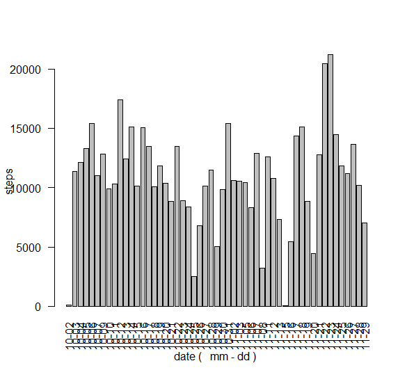
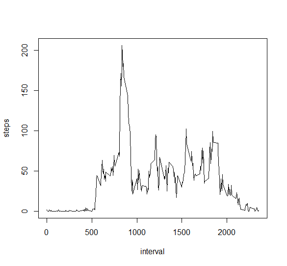
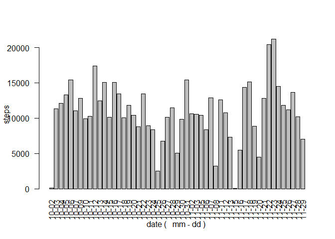
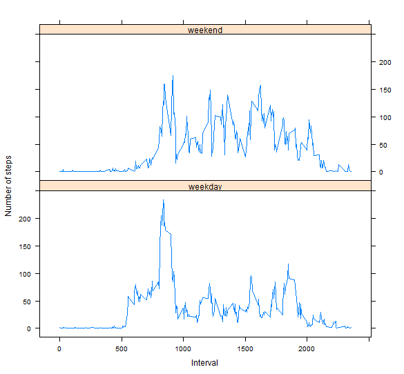

# Reproducible Research: Peer Assessment 1

Link to the html in Rpubs: http://rpubs.com/luzangeles/53816 
by Luz Eunice Angeles


opts_chunk$set(echo=TRUE, results='asis')

## Loading and preprocessing the data

```r
library(lubridate)
unzip("repdata_data_activity.zip")                                                                                    
activity <- read.csv("activity.csv")
activity ["md"] <- paste(month (as.Date(activity$date)) ,sprintf("%02.f", day (as.Date(activity$date))),sep="-")
```


## What is mean total number of steps taken per day?

1. Make a histogram of the total number of steps taken each day


```r
steps<- aggregate(steps ~ md, data=activity, FUN=sum)
barplot(steps$steps, names.arg=steps$md, xlab="date (   mm - dd ) " ,las =2,, ylab="steps")
```

 


 

 
2. Calculate and report the **mean** and **median** total number of
steps taken per day


```r
mean(steps$steps)
```

```
## [1] 10766.19
```

```r
median(steps$steps)
```

```
## [1] 10765
```


## What is mean total number of steps taken per day?


1. Make a time series plot (i.e. type = "l") of the 5-minute interval (x-axis) and the 
average number of steps taken, averaged across all days (y-axis)


```r
steps <- aggregate(steps ~ interval, data=activity, FUN=mean)
plot(steps, type="l")
```

 

 


2.Which 5-minute interval, on average across all the days in the dataset, contains the maximum number of steps?


```r
steps$interval[which.max(steps$steps)]
```

```
## [1] 835
```

## Imputing missing values

1. Calculate and report the total number of missing values in the dataset (i.e. the total number of rows with `NA`s)


```r
sum(is.na(activity))
```

```
## [1] 2304
```


2. Devise a strategy for filling in all of the missing values in the dataset. 
The strategy does not need to be sophisticated. For example, you could use the mean/median 
for that day, or the mean for that 5-minute interval, etc.

I will fill it with the mean of the day 


3.Create a new dataset that is equal to the original dataset but with the missing data filled in.


```r
#Calculate the mean of the day
steps<- aggregate(steps ~ md, data=activity, FUN=mean)
# make a join 
activity <- merge(activity, steps, by="md", suffixes=c("",".y"))
# obtain the rows that has NAs
nas <- is.na(activity$steps)
# sustitute the NAs steps with the mean of the day
activity$steps[nas] <- activity$steps.y[nas]
# create a new table activity
activity <- activity[,c(1:3)]
```


4.Make a histogram of the total number of steps taken each day and Calculate and report the mean and median total number of steps taken per day. Do these values differ from the estimates from the first part of the assignment? What is the impact of imputing missing data on the estimates of the total daily number of steps?


```r
steps <- aggregate(steps ~ md, data=activity, FUN=sum)
barplot(steps$steps, names.arg=steps$md, xlab="date (   mm - dd ) " ,las =2,, ylab="steps")
```

 

```r
mean(steps$steps)
```

```
## [1] 10766.19
```

```r
median(steps$steps)
```

```
## [1] 10765
```


 

The vale of the mean and the median is the same than the previos one. 
There is no impact of imputing missing data on the estimates of the total daily number of steps

##Are there differences in activity patterns between weekdays and weekends?


1. Create a new factor variable in the dataset with two levels - "weekday" and "weekend" indicating whether a given date is a weekday or weekend day.


```r
activity <- read.csv("activity.csv")

# function to obtain weekday or weekend
wdayend <- function(date) {
  if (weekdays(as.Date(date)) %in% c("Saturday", "Sunday")) {
    "weekend"
  } else {
    "weekday"
  }
}
activity$wdayend <- as.factor(sapply(activity$date, wdayend))

steps<- aggregate(steps ~   wdayend  + interval , data = activity, mean)
```


2.Make a panel plot containing a time series plot (i.e. type = "l") of the 5-minute interval (x-axis) and the average number of steps taken, averaged across all weekday days or weekend days (y-axis). See the README file in the GitHub repository to see an example of what this plot should look like using simulated data.


```r
# load the library lattice
library(lattice)
# make the  graph

xyplot(steps ~ interval | wdayend, steps, type = "l", layout = c(1, 2), 
       xlab = "Interval", ylab = "Number of steps")
```

 

 
